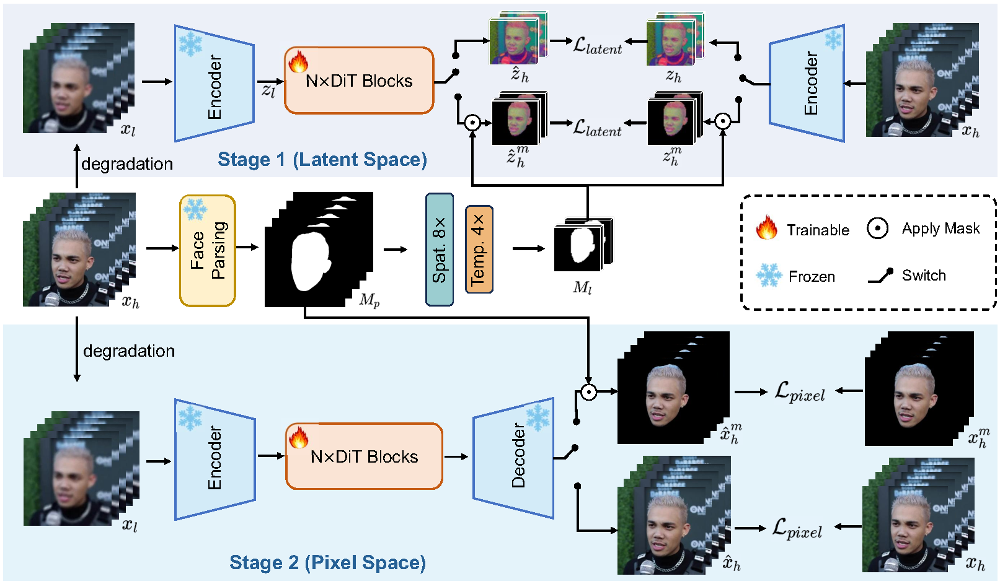

<div align="center">
<h1>VividFace: Face-Aware One-Step Diffusion for High-Fidelity Video Face Enhancement</h1>

<p>Shulian Zhang*, Long Peng*, Ziyang Wang, Ye Chen, Jie Li, Wenbo Li, Yulun Zhang, Jian Chen†, and Yong Guo†</p>

[](#)
[](https://shulianz.github.io/VividFace-Page)
[](LICENSE)
[](https://www.python.org/)

</div>

---

## Overview

Video Face Enhancement (VFE) aims to restore high-quality facial details from degraded video sequences, enabling a wide range of practical applications. Despite substantial progress in the field, current methods that primarily rely on video super-resolution and generative frameworks face three fundamental challenges: (1) computational inefficiency caused by iterative multi-step denoising in diffusion models; (2) insufficient recovery of fine-grained facial textures; and (3) poor restoration quality due to the lack of high-quality face video training data.
To address these challenges, we propose **VividFace**, a one-step diffusion framework that reformulates a text-to-video generation model into a single-step generator with switchable face-aware guidance that persistently focuses optimization on perceptually critical facial regions across both latent and pixel spaces. Furthermore, we propose a human-aligned MLLM-driven data curation pipeline that leverages the video understanding capabilities of Multimodal Large Language Models (MLLMs) and iteratively refines scoring criteria through lightweight human-in-the-loop calibration, yielding a high-quality face video dataset **MLLM-Face90**.
Extensive experiments demonstrate that VividFace achieves superior performance in perceptual quality, identity preservation, and temporal consistency across both synthetic and real-world benchmarks, while achieving a **12× inference speedup** over state-of-the-art diffusion-based VFE methods.



---

## Results

| Case 1 | Case 2 |
| :---: | :---: |
| <video src="https://github.com/user-attachments/assets/df5c2818-ef21-4cfa-8b96-48de895131f5" controls width="400"></video> | <video src="https://github.com/user-attachments/assets/a355b2f0-05da-4bc1-ae59-eec52f98257e" controls width="400"></video> |

---

## Getting Started

> **Requirements:** GPU with ≥ 16 GB VRAM

### 1. Clone the repository

```bash
git clone https://github.com/shulianz/VividFace.git
cd VividFace
```

### 2. Install dependencies

```bash
conda create -n vividface python=3.10 -y
conda activate vividface
pip install -r requirements.txt
```

---

## Download Checkpoints

### Base Model (Wan2.1)

Download from [Hugging Face](https://huggingface.co/Wan-AI/Wan2.1-T2V-1.3B) and place the following files under `models/`:

```
models/
├── models_t5_umt5-xxl-enc-bf16.pth
└── Wan2.1_VAE.pth
```

### VividFace Checkpoint

Download our pretrained checkpoint from [Releases](https://github.com/shulianz/VividFace/releases) and place it under `models/`:

```
models/
└── vividface.ckpt
```

---

## Inference

```bash
python examples/wanvideo/test_full_no_tile_face_release.py \
  --model_ckpt models/vividface.ckpt \
  --text_encoder_path models/models_t5_umt5-xxl-enc-bf16.pth \
  --vae_path models/Wan2.1_VAE.pth \
  --input_path /path/to/input_frames_root \
  --output_path /path/to/output
```

### Input format

Frames for each video should be stored in a dedicated sub-folder:

```
input_path/
├── video1/
│   ├── 00000000.png
│   ├── 00000001.png
│   └── ...
└── video2/
    └── ...
```

### Output format

Enhanced frames are saved in the same structure:

```
output_path/
├── video1/
│   ├── 00000000.png
│   ├── 00000001.png
│   └── ...
└── video2/
    └── ...
```

---

## License

This project is released under the [Apache 2.0 License](LICENSE).

---

## Acknowledgements

We gratefully acknowledge the following projects that made this work possible:

- [Wan Video Foundation Model](https://github.com/Wan-Video/Wan2.2)
- [DiffSynth-Studio](https://github.com/modelscope/diffsynth-studio)

---

<!-- ## Citation

If you find VividFace useful in your research, please consider citing:

```bibtex
@article{vividface2025,
  title   = {VividFace: Face-Aware One-Step Diffusion for High-Fidelity Video Face Enhancement},
  author  = {Zhang, Shulian and Peng, Long and Wang, Ziyang and Chen, Ye and Li, Jie and Li, Wenbo and Zhang, Yulun and Chen, Jian and Guo, Yong},
  journal = {arXiv preprint},
  year    = {2025}
}
``` -->
